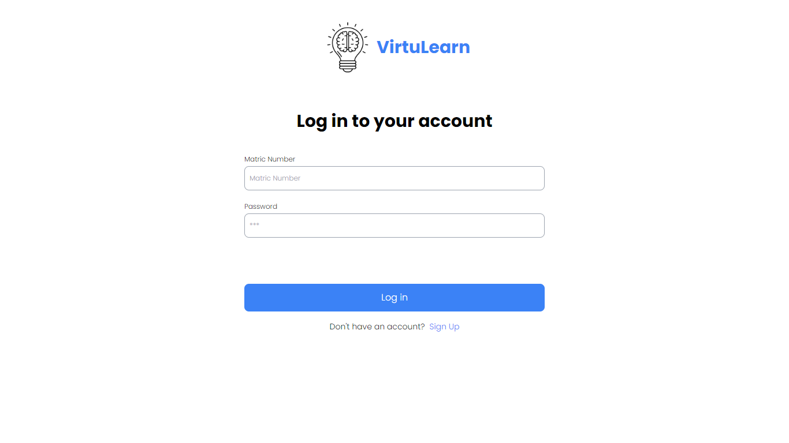
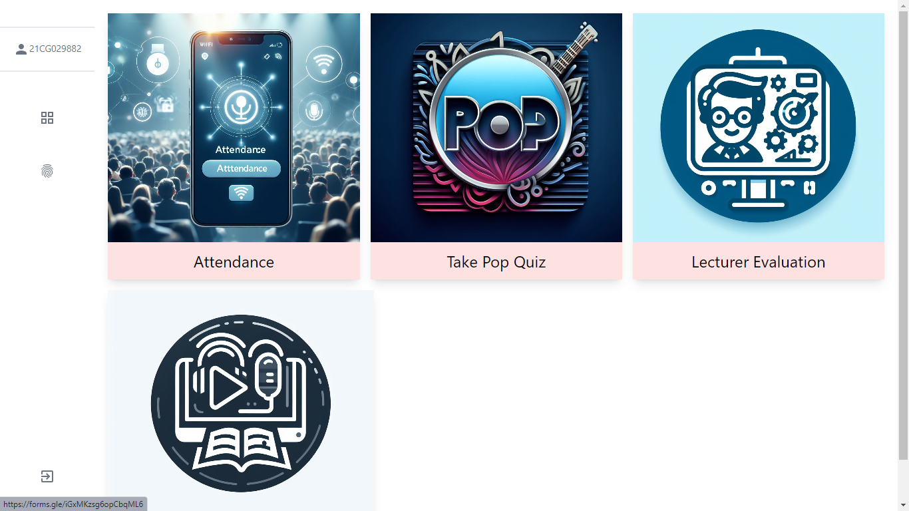

# Augmented Classroom Overview

## Problem Statement

In Nigerian public universities, crowded lecture halls often lead to a significant disparity in the learning experience. 🏫 Students seated at the back struggle to hear and see lectures, while attendance tracking becomes a time-consuming and error-prone task. Additionally, the risk of attendance fraud is a persistent concern, with students potentially signing in for absent peers. 🚫👥

## Project Solution

The Augmented Classroom project addresses these challenges through a tech-driven solution:

1. **Virtual Classroom:**
   - Lecturers can stream real-time audio and screen sharing, ensuring that all students, regardless of seating position, have a clear view and understanding of the lecture. 🎤📱

2. **WebAuthn Attendance:**
   - Students mark their attendance securely using WebAuthn, reducing the administrative burden of manual attendance and mitigating the risk of fraudulent sign-ins. ✅👩‍💻

3. **User-Friendly Interface:**
   - The platform features an intuitive interface for lecturers and students, simplifying navigation and usage. 🖥️👩‍🏫

4. **Real-Time Interaction:**
   - Live chat and Q&A sessions foster real-time engagement between lecturers and students during virtual classes. 💬👥

5. **Scalability:**
   - The system is designed to scale efficiently, accommodating a large number of students accessing the virtual classroom simultaneously. 📈👨‍🎓

6. **Security:**
   - Robust security measures, including encryption, safeguard user data and ensure compliance with data protection regulations. 🔐🛡️

7. **Device Compatibility:**
   - Accessible on various devices, the platform caters to diverse student preferences and capabilities. 📱💻

The Augmented Classroom project transforms traditional classrooms into dynamic, inclusive, and secure learning environments, enhancing the overall educational experience in Nigerian public universities. 🚀🎓
